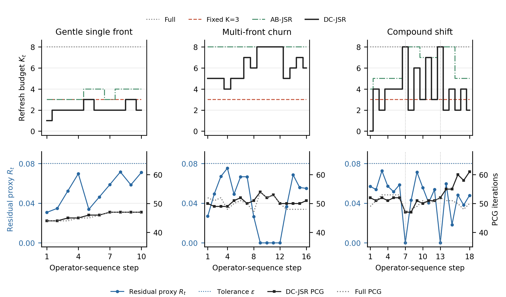

# Defect-Constrained Stateful Schwarz Preconditioner Maintenance (DC-JSR)

[](https://opensource.org/licenses/MIT)
[](https://www.python.org/)
[](https://petsc.org/)
[-brightgreen.svg)]()
[-brightgreen.svg)]()
[]()

> **Official Open-Source Research Codebase** accompanying the manuscript:  
> *"Stateful Selective Maintenance of Two-Level Schwarz Preconditioners for Evolving Sparse Linear Systems"*

---

## 💡 The Core Idea: Defect-Constrained Maintenance

Transient physical simulations—such as moving phase-change fronts, localized thermal softening, and dynamic crack damage—generate sequences of large, sparse, symmetric positive definite (SPD) linear systems:

$$A_t x_t = b_t, \quad t = 1, 2, \dots, T$$

Traditional domain decomposition solvers face an acute dilemma:
1. **Always Full Rebuild**: Factorizing all subdomains at every step incurs prohibitive setup costs (25%–80% of total runtime in 3D).
2. **Blind Static Reuse / Fixed Budget**: Reusing stale factors indefinitely or enforcing a rigid budget (e.g., fixed $K=3$) leads to severe Krylov iteration inflation and catastrophic wall-clock blowup when localized disturbances migrate or compound.

### The DC-JSR Principle

Instead of treating preconditioner updates as a collection of heuristic control rules, **DC-JSR (Defect-Constrained Joint Stateful Repair)** formulates preconditioner maintenance as a **single constrained optimization problem** governed by an accumulated normalized diagonal variation proxy.

```text
┌───────────────────────────────────────────────────────────────────────────────────────────────────┐
│                                     THE DC-JSR FORMULATION                                        │
│                                                                                                   │
│   1. Persistent State Evolution:                                                                  │
│        v_i(t) = ||diag(A_i(t)) - diag(A_i(t-1))||_2 / ||diag(A_i(t))||_2                          │
│        V_i^-(t) = V_i(t-1) + v_i(t)                                                               │
│                                                                                                   │
│   2. Closed-Form Minimum-Cardinality Selector:                                                    │
│        min |S|  s.t.  max_{i ∉ S} V_i^-(t) ≤ ε   ===>   S_t* = { i : V_i^-(t) > ε }                │
│                                                                                                   │
│   3. State Commitment & Reset:                                                                    │
│        V_i(t) = 0 if i ∈ S_t*,  else V_i^-(t)                                                     │
│                                                                                                   │
│   4. Coarse Space Synchronization:                                                                │
│        A_0(t) = Z^T A_t Z   (updated at every step on fixed coarse basis Z)                       │
└───────────────────────────────────────────────────────────────────────────────────────────────────┘
```

* **Zero Empirical Heuristics**: Replaces multi-parameter controllers (hysteresis, dispersion thresholds, cooldown timers, and age-damping) with a **single, transparent algebraic tolerance** ($\varepsilon = 0.08$).
* **Provably Optimal in $O(M)$**: For the maximum residual proxy constraint $\max_{i \notin S} V_i^-(t) \le \varepsilon$ and strictly positive maintenance costs, $S_t^\star = \{i : V_i^-(t) > \varepsilon\}$ is the **unique global minimum-cardinality solution**, computable in linear time $O(M)$ without combinatorial search.
* **Autonomous Budget Emergence**: The maintenance budget $K_t = |S_t^\star|$ is an autonomous output of the constraint: zero refresh ($K_t=0$), partial maintenance ($K_t \in [1, 4]$), and emergency full rebuild ($K_t = M$) naturally emerge from the exact same rule.

---

## 📊 Certified Experimental Benchmark Results

Evaluated on rigorous 3D finite element thermal/diffusion operator sequences ($N=24$, $15{,}625$ DOFs; 8 overlapping subdomains, MUMPS sparse direct solvers, symmetric weighted two-level additive Schwarz).

All results are certified with **dual independent true residual checks** (PETSc explicit residual and standalone CSR evaluation) strictly enforcing $\|b_t - A_t x_t\|_2 / \|b_t\|_2 < 1.0 \times 10^{-8}$. Across all **876 certified solves**, zero solver retries were triggered, with a maximum relative true residual of **$3.276 \times 10^{-9}$**.

### Primary Comparison Across Operating Regimes (4 Randomized Repeats)

| Operating Regime | Sequence Steps | Full Rebuild | Fixed $K=3$ | AB-JSR (Legacy) | **DC-JSR (Ours)** | DC / Full Time Ratio | DC vs. Full Win Rate | Peak PCG Iterations (Full / K3 / DC) |
| :--- | :---: | :---: | :---: | :---: | :---: | :---: | :---: | :---: |
| **Gentle Single-Front** | 10 | $6.077 \pm 0.061\text{ s}$ | $5.303 \pm 0.030\text{ s}$ | $5.387 \pm 0.039\text{ s}$ | **$5.146 \pm 0.028\text{ s}$** | **$0.847\times$** ($-15.3\%$) | **4 / 4** | 47 / 47 / 47 |
| **Multi-Front Churn** | 16 | $10.541 \pm 0.143\text{ s}$ | $27.507 \pm 0.218\text{ s}$ | $10.541 \pm 0.094\text{ s}$ | **$10.298 \pm 0.160\text{ s}$** | **$0.977\times$** ($-2.3\%$) | **3 / 4** | 54 / **245** / 54 |
| **Compound Shift** | 18 | $12.054 \pm 0.142\text{ s}$ | $25.222 \pm 0.070\text{ s}$ | $11.443 \pm 0.086\text{ s}$ | **$11.195 \pm 0.108\text{ s}$** | **$0.929\times$** ($-7.1\%$) | **4 / 4** | 53 / **201** / 61 |
| **Staccato Revisit** | 16 | $10.296 \pm 0.041\text{ s}$ | — | — | **$9.596 \pm 0.140\text{ s}$** | **$0.932\times$** ($-6.8\%$) | **2 / 2** | 55 / — / 55 |

* **Key Takeaway 1 (Benign Acceleration)**: In gentle regimes, DC-JSR operates at $K_t \in [1, 2, 3]$, saving $15.3\%$ total wall-clock time over Full Rebuild while matching PCG convergence step-for-step.
* **Key Takeaway 2 (Catastrophic Prevention)**: Under complex multi-front churn, Fixed $K=3$ suffers severe iteration collapse (245 iterations!). DC-JSR autonomously escalates to $K_t \in [5, 8]$, matching Full convergence (54 iterations) and avoiding solver breakdown.
* **Key Takeaway 3 (Automatic Shock Absorption)**: In the compound shift regime, at the exact physical shock steps ($t=7$ and $t=13$), DC-JSR **spontaneously hits $K_7 = 8$ and $K_{13} = 8$** (full rebuild), absorbing the physical perturbation without requiring any hardcoded emergency triggers.

---

## 📈 Visualizing Adaptive Budget & Convergence Stability



* **Top Row**: Dynamic refresh budget $K_t$ across time steps. Notice how DC-JSR (solid black) adaptively scales between low-cost maintenance ($K \approx 2$) and full rebuilds ($K=8$ at $t=7, 13$).
* **Bottom Row**: Post-refresh residual proxy $R_t = \max_{i \notin S} V_i^-(t)$ strictly bounded below $\varepsilon = 0.08$ (blue line), while PCG iteration counts (black squares) closely track Full Rebuild (dotted grey).

---

## 🔬 Methodological Differentiation

| Dimension | Instantaneous Drift Trigger | Svolos et al. (*JCP* 2020) | Reactive Solver Trigger | **DC-JSR (This Work)** |
| :--- | :--- | :--- | :--- | :--- |
| **State Information** | Single-step matrix change $\|A_t - A_{t-1}\|$ | Physical damage field $\Delta d$ & runtime profiling | PCG iteration count or residual stagnation | **Accumulated diagonal variation $V_i^-(t)$ along unrefreshed interval** |
| **Physics Dependency** | None | High (requires crack tip tracking) | None | **Purely algebraic & black-box** |
| **Coarse Treatment** | Independent | 1-Level ASM (no coarse space) | Independent | **Coupled Galerkin update $A_0(t) = Z^T A_t Z$ on fixed coarse basis $Z$** |
| **Selection Rule** | Threshold or fixed rank | Dedicated crack-region vs. healthy-region heuristic | Full rebuild upon stagnation | **Unique closed-form solution: $S_t^\star = \{i : V_i^-(t) > \varepsilon\}$** |
| **Memory Lifecycle** | Memoryless | Process history | Post-solve history | **State accumulates during reuse and resets strictly upon factor rebuild** |
| **Failure Mode** | Blind to slow cumulative drift | Inapplicable outside fracture | Pays latency penalty before rebuilding | **Guaranteed to catch slow drift via cumulative path length** |

---

## 🚀 Quick Start & Reproducibility

### 1. Mathematical Policy Contract Tests (No Heavy Dependencies)

Verify the closed-form optimality across 200 random 8-subdomain instances with exhaustive 256-subset brute-force proofs:

```bash
python tests/test_dc_jsr_policy.py
```

### 2. Plotting Publication Figures

Regenerate the publication-grade PDF and PNG figures from certified machine JSON audits:

```bash
python benchmarks/plot_dc_jsr_manuscript.py
```

### 3. Running the Full 876-Solve Certification Suite

To run the complete 4-repeat certification audit across all regimes with MUMPS and PETSc:

```bash
# Requires FEniCS / PETSc environment
python benchmarks/run_dc_jsr_certification_audit.py --repeats 4
```

---

## 📂 Repository Directory Layout

```text
├── benchmarks/
│   ├── run_dc_jsr_certification_audit.py  # Primary 4-repeat certification audit runner
│   ├── run_dc_jsr_shadow_prototype.py     # Clean DC-JSR algorithm reference implementation
│   └── plot_dc_jsr_manuscript.py          # Publication figure generation script
├── tests/
│   └── test_dc_jsr_policy.py              # Unit test suite (200 cases, 256 subsets brute force)
├── results/
│   ├── dc_jsr_certification_audit_n24.json# Step-by-step raw metrics for 876 certified solves
│   └── dc_jsr_validation_summary_2026-10-03.json # Verification summary (hashes, residuals, coarse checks)
├── docs/
│   ├── main.tex                           # Full CMAME manuscript LaTeX source
│   ├── figures/
│   │   ├── dc_jsr_budget_proxy_pcg.pdf    # Vector graphic for manuscript
│   │   └── dc_jsr_budget_proxy_pcg.png    # High-resolution raster preview
│   └── archive/                           # Historical campaign artifacts and exploratory baselines
└── README.md                              # This authoritative repository overview
```

---

## 📜 Citation

If you use this work or codebase in your research, please cite:

```bibtex
@article{dc_jsr_2026,
  title   = {Stateful Selective Maintenance of Two-Level Schwarz Preconditioners for Evolving Sparse Linear Systems},
  author  = {JSR Research Group},
  journal = {Computer Methods in Applied Mechanics and Engineering},
  year    = {2026},
  note    = {Under Review}
}
```

---

## 📄 License

This project is licensed under the [MIT License](LICENSE).
