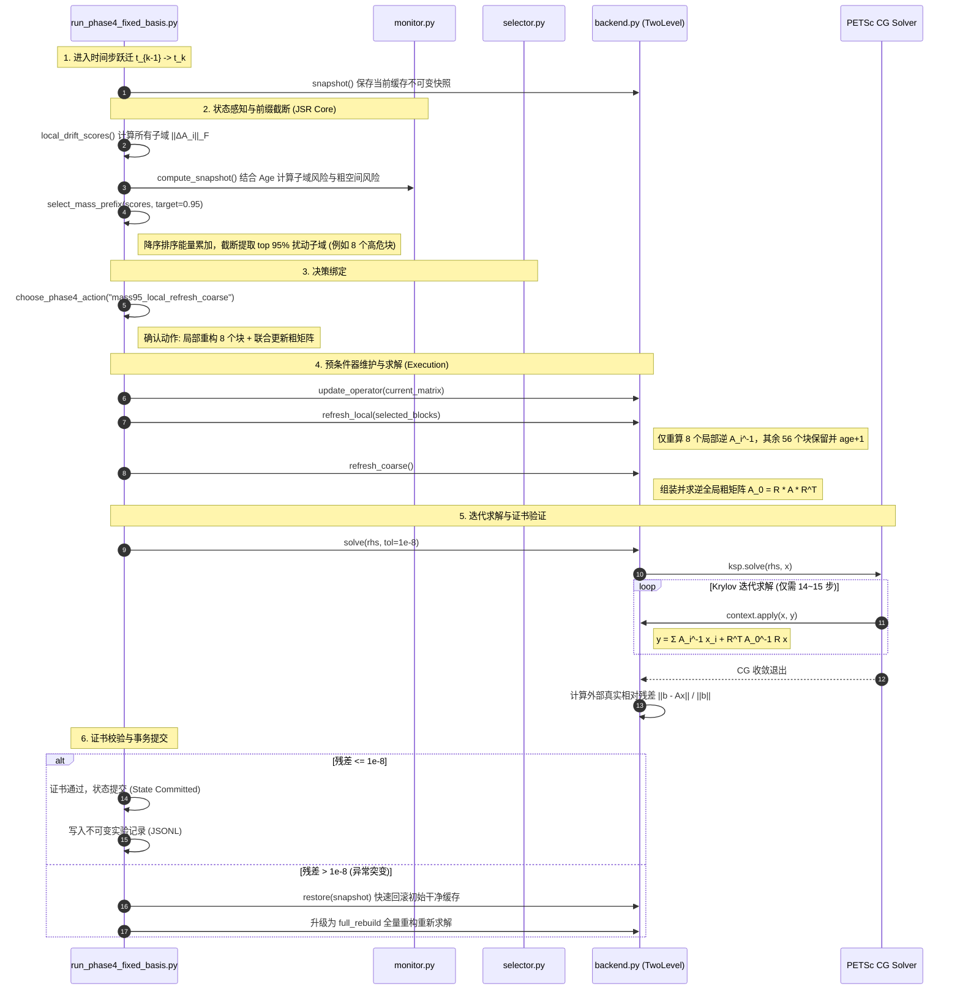

# JSR (Joint Stateful Repair) 完整代码架构与实现细节逐行精讲手册

> 本文档系统性梳理“演化算子下多层 Schwarz 预条件器有状态联合维护（JSR）”在生产代码库中的完整结构，自顶向下穿透至**文件目录 -> 核心类/函数 -> 关键源码逐行精细注释与数学原理映射**。专为论文撰写与代码底层深度学习打造。

---

## 目录
1. [一、 顶层架构与文件拓扑](#一-顶层架构与文件拓扑)
2. [二、 预条件器与缓存引擎：`corrected_phase2/backend.py`](#二-预条件器与缓存引擎corrected_phase2backendpy)
3. [三、 因果漂移与风险感知器：`corrected_phase2/monitor.py`](#三-因果漂移与风险感知器corrected_phase2monitorpy)
4. [四、 mass95 核心截断与运行调度器：`run_phase2_2_comparative.py` & `run_phase4_fixed_basis.py`](#四-mass95-核心截断与运行调度器run_phase2_2_comparativepy--run_phase4_fixed_basispy)
5. [五、 成本模型与自适应动作选择器：`corrected_phase2/selector.py`](#五-成本模型与自适应动作选择器corrected_phase2selectorpy)
6. [六、 进阶理论：Phase 4-B 动态谱粗空间自适应基底：`corrected_phase2/changing_basis.py`](#六-进阶理论phase-4-b-动态谱粗空间自适应基底corrected_phase2changing_basispy)
7. [七、 单步生命周期微观执行流（$t \to t+1$ 序列图）](#七-单步生命周期微观执行流t-to-t1-序列图)
8. [八、 核心参数与经验先验汇总表](#八-核心参数与经验先验汇总表)
9. [九、 论文写作映射速查：代码变量与学术论文 LaTeX 符号全对照](#九-论文写作映射速查代码变量与学术论文-latex-符号全对照)

---

## 一、 顶层架构与文件拓扑

```text
/mnt/h/mypaper/.../correction_partition_v1_20260828/
│
├── corrected_phase2/                        # JSR 核心算法包
│   ├── __init__.py
│   ├── backend.py                           # 【预条件核心】两级 Schwarz 算子、Factor/CoarseState 缓存生命周期
│   ├── monitor.py                           # 【有状态感知】Frobenius 局部矩阵差分、Age 老化加权与风险评估
│   ├── selector.py                          # 【决策调度】候选动作枚举、历史在线成本评估 (OnlineHistory)
│   ├── changing_backend.py                  # 【动态谱基扩展】Phase 4-B 谱粗空间支持
│   └── changing_basis.py                    # 【动态谱基扩展】GenEO 谱特征向量粗网格投影
│
├── run_phase2_2_comparative.py              # 【生产运行调度】local_drift_scores、select_mass_prefix (mass95)
├── run_phase4_fixed_basis.py                # 【消融验证】固定粗基消融驱动 (证明联合更新 coarse 的必要性)
└── run_phase5a_sparse_backend.py            # 【稀疏边界准入】PETSc GAMG 稀疏后端生命周期准入对比
```

### 核心分工与数据流

```
       [ 真实演化物理场 A_t ]
                 │
                 ▼
     [ monitor.py / runner ]  ───────> 计算各局部子域漂移量 ||ΔA_i||_F 与年龄 Age_i
                 │
                 ▼
   [ select_mass_prefix (mass95) ]  ───> 降序排序能量累加，截断提取 top 95% 扰动子域
                 │
                 ▼
          [ backend.py ]      ───────> refresh_local(selected)  (只求逆选中块)
                 │                     refresh_coarse()          (联合更新粗网格 A_0)
                 ▼
        [ TwoLevelContext ]   ───────> PETSc CG 迭代求解 A_t x = b (快速收敛)
                 │
                 ▼
     [ True-Residual Certificate ] ──> ||b - Ax|| / ||b|| <= 1e-8 验收，异常则触发回滚
```

---

## 二、 预条件器与缓存引擎：`corrected_phase2/backend.py`

这是整个系统底层数值操作的枢纽，将两级 Schwarz 预条件器的每个局部逆和粗网格抽象为**不可变缓存对象（Immutable Cache Objects）**。

### 1. 核心数据结构与内存布局

#### (1) `Factor`（局部子域逆缓存，Level 1 缓存对象）
每个子域独立持有一份局部对角主子阵的逆矩阵 $A_i^{-1}$。为了实现“有状态”跟踪，它必须打上构建时间戳 `build_state`。

```python
@dataclass(frozen=True)  # 设置为不可变对象 (Frozen)，防止在并发或迭代中被意外修改
class Factor:
    # 局部子域拥有的全局自由度索引 (例如 2,289 个节点的全局行号)
    # 数学对应: 局部子域限制算子 R_i 的有效非零列集合
    indices: np.ndarray  # 类型: 一维 int64 数组，形状: (len(indices),)

    # 局部密集逆矩阵 A_i^{-1} = inv(A[indices, indices])
    # 数学对应: 局部狄利克雷/诺伊曼子问题的高精度精确局部逆
    inverse: np.ndarray  # 类型: 连续二维 float64 数组，形状: (len(indices), len(indices))

    # 【有状态核心元数据】：记录该缓存是基于物理时间步几构建的 (例如 t=0 或 t=3)
    # 用于 monitor.py 准确回溯该子域自构建以来的累积物理漂移量
    build_state: int     # 类型: int，历史时间步索引

    def signature(self) -> str:
        """
        计算逆矩阵内存字节流的 SHA-256 密码学哈希值。
        用于生成不可变审计证据链 (Audit Trail)，保证实验过程 100% 可复现、防篡改。
        """
        return array_sha(self.inverse)
```

#### (2) `CoarseState`（全局粗网格算子状态缓存，Level 2 缓存对象）
记录全局低频粗算子 $A_0 = R_0 A R_0^T$ 及其逆 $A_0^{-1}$。

```python
@dataclass(frozen=True)
class CoarseState:
    # 粗网格 Galerkin 投影矩阵 A_0 (尺寸例如 64x64 或 144x144)
    # 数学对应: A_0 = R_0 * A * R_0^T
    matrix: np.ndarray       # 类型: 二维对称 float64 数组

    # 粗网格的显式逆矩阵 A_0^{-1} = inv(A_0)，用于每步 Krylov 迭代时极速反解宏观残差
    inverse: np.ndarray      # 类型: 二维 float64 数组，尺寸 (p, p)

    # 粗网格缓存构建时对应的时间步编号 (用于计算 coarse_age = current_state - build_state)
    build_state: int         # 类型: int

    # 性能诊断指标：记录本次三矩阵积装配所消耗的绝对物理时间 (秒)
    assembly_seconds: float  # 类型: float

    # 性能诊断指标：记录小矩阵求逆所消耗的绝对物理时间 (通常仅 0.01~0.02 秒)
    factorization_seconds: float

    # 数值稳定性核验：对称性误差 ||A_0 - A_0^T||_max，确保矩阵完全对称
    symmetry_error: float

    # 正定性保障：粗矩阵的最小特征值 lambda_min(A_0)，必须严格 > 0 确保 SPD
    minimum_eigenvalue: float

    @property
    def matrix_digest(self) -> str:
        """粗矩阵本身的 SHA-256 散列"""
        return array_sha(self.matrix)

    @property
    def inverse_digest(self) -> str:
        """粗逆算子的 SHA-256 散列"""
        return array_sha(self.inverse)
```

#### (3) `CacheSnapshot`（事务恢复快照）
当系统尝试执行激进的自适应选择时，必须先对当前状态进行无损快照。一旦求解器无法收敛达标，调用 `restore(snapshot)` 零损伤回滚。

```python
@dataclass(frozen=True)
class CacheSnapshot:
    factors: Tuple[Factor, ...]   # 全场 p 个局部因子的浅拷贝元组
    build_states: np.ndarray       # 长度为 p 的一维数组，记录各子域构建步
    ages: np.ndarray               # 长度为 p 的一维数组，记录各子域当前存活年龄
    coarse: CoarseState            # 当前粗空间对象
    coarse_build_state: int        # 粗空间构建步
    coarse_age: int                # 粗空间已存活年龄
```

---

### 2. 核心算法函数与类逐行解析

#### (1) `TwoLevelContext`（两级预条件算子前向应用，PETSc Python-PC 回调）
在每一次 Krylov（CG）迭代时，PETSc 会调用一次 `apply(pc, x, y)`，完成：
$$y = M^{-1} x = \sum_{i=1}^p R_i^T A_i^{-1} R_i x + R_0^T A_0^{-1} R_0 x$$

```python
class TwoLevelContext:
    def __init__(self, factors: Sequence[Factor], aggregate: np.ndarray, coarse: CoarseState):
        self.factors = list(factors)                           # 64/144 个局部子域逆因子列表
        self.aggregate = np.asarray(aggregate, dtype=np.int64) # 长度为 n 的映射数组: 第 i 个节点属于第几号子域
        self.coarse = coarse                                   # 粗网格状态对象 (包含 A_0^{-1})
        self.calls = 0                                         # Krylov 迭代步中被调用的总次数计数器
        self.seconds = 0.0                                     # 累计执行预条件前向应用的总耗时

    def apply(self, pc, x, y):
        """
        【两级加性 Schwarz 前向应用核心函数】
        :param pc: PETSc 预条件器 C++ 对象指针
        :param x: 输入向量 (当前微观残差向量 r_k)
        :param y: 输出向量 (预条件修正量 y = M^{-1} * r_k)
        """
        # 记录前向计算起始物理时间
        started = time.perf_counter()
        
        # 1. 提取 PETSc 向量底层的原始 NumPy 连续内存视图 (只读，避免内存拷贝)
        xa = np.asarray(x.getArray(readonly=True)) # 形状: (n,)，全局 146,689 个自由度
        ya = y.getArray()                          # 形状: (n,)，可写缓冲区
        ya[:] = 0.0                                # 初始化清零输出

        # =========================================================================
        # 阶段 1 (Level 1): 局部子域独立前向反解 (消除微观高频震荡误差)
        # 数学公式: y_local = \sum_{i=1}^p R_i^T A_i^{-1} R_i x
        # =========================================================================
        for factor in self.factors:
            indices = factor.indices  # 提取第 i 个子域拥有的节点索引 (R_i 限制算子)
            
            # factor.inverse.dot(...) 执行局部矩阵-向量乘法 A_i^{-1} * x[indices]
            # 并通过 ya[indices] += ... 累加回全局向量 (R_i^T 延拓算子)
            ya[indices] += factor.inverse.dot(xa[indices])

        # =========================================================================
        # 阶段 2 (Level 2): 全局粗网格限制与延拓 (消除跨子域宏观低频长波误差)
        # 数学公式: y_coarse = R_0^T A_0^{-1} R_0 x
        # =========================================================================
        # 巧妙利用 np.bincount 实现常数基限制投影 R_0 * x:
        # aggregate[row] 标明了节点属于哪一个粗网格节点，weights=xa 将属于同一子域的残差直接相加
        restricted = np.bincount(
            self.aggregate,
            weights=xa,
            minlength=self.coarse.inverse.shape[0],  # 确保输出长度等于粗节点总数 p
        )
        
        # self.coarse.inverse.dot(restricted): 求解粗方程 s = A_0^{-1} * (R_0 x)
        # [self.aggregate]: 执行延拓插值 R_0^T，将宏观粗解赋值回各个细节点上
        ya[:] += self.coarse.inverse.dot(restricted)[self.aggregate]
        
        # 通知 PETSc 向量装配结束
        y.assemble()
        self.calls += 1
        self.seconds += time.perf_counter() - started
```

#### (2) `assemble_coarse_operator(...)`（固定常数基 Galerkin 粗矩阵极速装配）
执行：$A_0 = R_0 A R_0^T$，其中 $(A_0)_{I, J} = \sum_{i \in \mathcal{D}_I} \sum_{j \in \mathcal{D}_J} A_{i, j}$。

```python
def assemble_coarse_operator(matrix: dict, aggregate: np.ndarray,
                             dimension: int, build_state: int) -> CoarseState:
    """
    【流式稀疏 Galerkin 投影装配算法】
    直接在线性遍历 CSR 非零元的过程中将权重归纳累加至粗网格矩阵，空间复杂度仅为 O(p^2)
    """
    assembly_started = time.perf_counter()
    n = int(matrix["shape"][0])                      # 自由度总数 n = 146,689
    coarse = np.zeros((int(dimension), int(dimension)), dtype=np.float64) # 分配 pxp 稠密矩阵
    
    # 逐行遍历 CSR 稀疏矩阵
    for row in range(n):
        row_aggregate = int(aggregate[row])          # 确定当前行所属的粗子域号 I
        lo = int(matrix["indptr"][row])              # CSR 行非零元起始偏移
        hi = int(matrix["indptr"][row + 1])          # CSR 行非零元终止偏移
        
        # 遍历第 row 行内的所有非零列 col 与非零值 value
        for col, value in zip(matrix["indices"][lo:hi], matrix["data"][lo:hi]):
            col_aggregate = int(aggregate[int(col)]) # 确定当前列所属的粗子域号 J
            # 将物理刚度权重累加到粗矩阵对应分块格子 coarse[I, J]
            coarse[row_aggregate, col_aggregate] += float(value)
            
    assembly_seconds = time.perf_counter() - assembly_started

    # 对称化修正以消除机器浮点截断微小非对称误差: A_0 = 0.5 * (A_0 + A_0^T)
    factor_started = time.perf_counter()
    symmetry_error = float(np.max(np.abs(coarse - coarse.T)))
    symmetric = 0.5 * (coarse + coarse.T)
    
    # 尺寸极小 (64x64 或 144x144)，直接调用 LAPACK dgetrf/dgetri 进行密集求逆，耗时仅 10ms~20ms
    inverse = np.linalg.inv(symmetric)
    
    # 正定性检测：计算最小特征值，确保没有负特征值出现
    minimum_eigenvalue = float(np.linalg.eigvalsh(symmetric)[0])
    factorization_seconds = time.perf_counter() - factor_started
    
    return CoarseState(
        matrix=symmetric,
        inverse=inverse,
        build_state=int(build_state),
        assembly_seconds=float(assembly_seconds),
        factorization_seconds=float(factorization_seconds),
        symmetry_error=symmetry_error,
        minimum_eigenvalue=minimum_eigenvalue,
    )
```

#### (3) `CorrectedStatefulTwoLevel`（预条件器有状态全生命周期总控器）
管理增量维护、算子原地装配、事务快照与收敛认证。

```python
class CorrectedStatefulTwoLevel:
    # ---------------- 算子原地装载 ----------------
    def update_operator(self, matrix: dict) -> float:
        """原地更新 PETSc 底层矩阵数值，不释放也不重新分配 C++ 对象内存"""
        self._check_pattern(matrix) # 校验稀疏图拓扑不变性
        started = time.perf_counter()
        self.operator.setValuesCSR(
            np.asarray(matrix["indptr"], dtype=self.PETSc.IntType),
            np.asarray(matrix["indices"], dtype=self.PETSc.IntType),
            np.asarray(matrix["data"], dtype=self.PETSc.ScalarType),
            addv=self.PETSc.InsertMode.INSERT_VALUES, # 原地覆盖旧数值
        )
        self.operator.assemblyBegin()
        self.operator.assemblyEnd()
        return float(time.perf_counter() - started)

    # ---------------- JSR 局部子域增量求逆 ----------------
    def refresh_local(self, matrix: dict, current_state: int, selected: Iterable[int]) -> dict:
        """只针对选中的 selected 高危子块重新求逆，其余子域 age+1"""
        selected_tuple = tuple(sorted(set(int(value) for value in selected)))
        started = time.perf_counter()
        
        # 1. 仅为选中的子域执行密集子矩阵提取与 np.linalg.inv 求逆
        rebuilt = self._build_factor_objects(matrix, current_state, selected_tuple)
        
        # 2. 更新命中的子域缓存，重置其年龄为 0，记录构建步为当前步
        for block, factor in rebuilt.items():
            self.factors[block] = factor
            self.build_states[block] = int(current_state)
            self.ages[block] = 0
            
        # 3. 未被选中的子域继续复用旧缓存，存活年龄 age 自增 1
        selected_set = set(selected_tuple)
        for block in range(self.factor_count):
            if block not in selected_set:
                self.ages[block] += 1
                
        # 4. 同步更新上下文内部引用
        self.context.factors = list(self.factors)
        return {"seconds": float(time.perf_counter() - started), "selected_blocks": list(selected_tuple)}

    # ---------------- JSR 粗空间联合装配 ----------------
    def refresh_coarse(self, matrix: dict, current_state: int) -> dict:
        """重新组装并求逆全局粗网格矩阵，粗网格年龄重置为 0"""
        started = time.perf_counter()
        coarse = assemble_coarse_operator(matrix, self.aggregate, self.factor_count, int(current_state))
        self.coarse = coarse
        self.coarse_build_state = int(current_state)
        self.coarse_age = 0
        self.context.coarse = coarse # 同步绑定至前向 PC 上下文
        return {"seconds": float(time.perf_counter() - started)}

    # ---------------- 独立外部物理残差认证求解 ----------------
    def solve(self, rhs: np.ndarray, residual_tolerance: float = 1.0e-8):
        """
        调用 PETSc PCG 迭代求解，并在外部独立严密验算真实相对残差
        """
        b = self.PETSc.Vec().createSeq(self.n)
        x = self.PETSc.Vec().createSeq(self.n)
        residual = self.PETSc.Vec().createSeq(self.n)
        b.setArray(rhs.copy())
        x.set(0.0) # 零初始猜测
        started = time.perf_counter()
        try:
            # 1. 启动 PETSc CG 迭代求解
            self.ksp.solve(b, x)
            solve_seconds = time.perf_counter() - started
            
            # 2. 外部独立核算真实物理残差: r = A*x - b (绝不盲从求解器内部预条件残差)
            self.operator.mult(x, residual)
            residual.axpy(-1.0, b)
            rhs_norm = float(b.norm())
            residual_norm = float(residual.norm())
            relative = residual_norm / max(rhs_norm, 1.0e-300)
            
            # 3. 严格验票：KSP 返回收敛 且 真实相对残差 <= 1.0e-8
            reason = int(self.ksp.getConvergedReason())
            iterations = int(self.ksp.getIterationNumber())
            converged = bool(reason > 0 and relative <= float(residual_tolerance))
            
            return {
                "iterations": iterations,
                "converged": converged,
                "true_residual": float(relative),
                "solve_seconds": float(solve_seconds),
            }, np.asarray(x.getArray(readonly=True)).copy(), np.asarray(residual.getArray(readonly=True)).copy()
        finally:
            b.destroy(); x.destroy(); residual.destroy()
```

---

## 三、 因果漂移与风险感知器：`corrected_phase2/monitor.py`

本模块充当 JSR 架构的“前沿雷达”：
1. **有状态感知 (Stateful)**：记录每个子域上次构建的时间戳 (`build_state`) 和存活代数 (`age`)，计算相对于“该子域上次求逆时的基准状态”的累积相对 Frobenius 漂移量；
2. **因果律保证 (Causal)**：严格禁止前瞻！只能读取已提交的历史矩阵字典 (`state_matrices`)，杜绝一切面向未来的数据泄露；
3. **粗空间风险联动**：不仅监控局部子域，还综合评估低频宏观粗空间的陈旧度，为两级联合维护提供量化决策依据。

### 1. 配置与状态类：`MonitorConfig` & `RiskSnapshot`

```python
@dataclass(frozen=True)
class MonitorConfig:
    """
    监控器超参数配置项 (冻结参数，不可变数据类)
    
    属性说明:
    - age_weight: 存活年龄惩罚系数 (默认 0.20)。
      公式: risk = drift * (1.0 + age_weight * age)
      含义: 某个子域即使当前漂移较小，但如果存活了 5 代 (age=5)，其名义风险也会翻倍 (1 + 0.2*5 = 2.0)，
      强制打破慢性累积，促使算法定期淘汰老化缓存。
    - coarse_mean_weight: 粗空间风险计算中，全部局部子域平均风险的权重 (默认 0.70)。
    - coarse_max_weight: 粗空间风险计算中，局部子域最大单点风险的权重 (默认 0.30)。
    """
    age_weight: float = 0.20
    coarse_mean_weight: float = 0.70
    coarse_max_weight: float = 0.30


@dataclass(frozen=True)
class RiskSnapshot:
    """
    状态风险快照 (不可变对象，用于在时间步转换决策前固化当前所有的风险指标)
    
    属性说明:
    - previous_state: 上一个物理时间步 (如 t=3)
    - current_state:  当前即将求解的时间步 (如 t=4)
    - local_drift:    元组，记录每个子域自上次重构以来的纯物理相对 Frobenius 漂移量 ||ΔA_i||_F / ||A_i||_F
    - local_risk:     元组，记录每个子域叠加存活年龄惩罚后的综合风险值
    - local_age:      元组，记录每个局部子域缓存已存活的时间步数 (Age)
    - coarse_matrix_risk: 全局粗网格矩阵的综合陈旧风险评估值
    - coarse_age:     全局粗网格缓存已存活的时间步数
    - trajectory:     当前运行的演化轨迹名称 (如 baseline_moving_local 或 stress_moving_interface)
    - basis_fixed:    粗空间投影基是否固定 (Phase 4 默认为 True)
    - future_information_used: 因果标志位，恒为 False，用于形式化审计是否泄露未来数据
    """
    previous_state: int
    current_state: int
    local_drift: Tuple[float, ...]
    local_risk: Tuple[float, ...]
    local_age: Tuple[int, ...]
    coarse_matrix_risk: float
    coarse_age: int
    trajectory: str = ""
    basis_fixed: bool = True
    future_information_used: bool = False

    @property
    def max_local_risk(self) -> float:
        """获取所有局部子域中的最高单点风险值 (用于触发局部硬预算熔断)"""
        return max(self.local_risk) if self.local_risk else 0.0

    @property
    def mean_local_risk(self) -> float:
        """获取全场所有局部子域的平均风险值"""
        return float(sum(self.local_risk) / max(len(self.local_risk), 1))

    def to_dict(self) -> Dict[str, object]:
        """将不可变快照转换为标准字典，用于序列化记录到实验 JSONL 日志中"""
        return {
            "previous_state": int(self.previous_state),
            "current_state": int(self.current_state),
            "local_drift": list(self.local_drift),
            "local_risk": list(self.local_risk),
            "local_age": list(self.local_age),
            "coarse_matrix_risk": float(self.coarse_matrix_risk),
            "coarse_age": int(self.coarse_age),
            "trajectory": self.trajectory,
            "basis_fixed": bool(self.basis_fixed),
            "future_information_used": bool(self.future_information_used),
        }
```

### 2. 核心感知函数：`compute_snapshot` 逐行解析

```python
def compute_snapshot(
    current: Dict[str, np.ndarray],
    domains: Sequence[np.ndarray],
    local_build_states: Sequence[int],
    local_ages: Iterable[int],
    state_matrices: Dict[int, Dict[str, np.ndarray]],
    coarse_build_state: int,
    previous_state: int,
    current_state: int,
    config: MonitorConfig = MonitorConfig(),
    trajectory: str = "",
) -> RiskSnapshot:
    """
    【核心感知函数】：计算当前状态与历史基准之间的多层风险快照
    
    设计准则:
    1. 严格遵守因果律: 仅使用当前矩阵 current 以及先前已经产生并缓存在 state_matrices 中的历史状态。
       绝不允许传入或查询任何大于 current_state 的未来算子。
    2. 计算开销极低: 仅针对各子域的非零元执行切片差分，不执行任何矩阵求逆或求解操作，毫秒级完成。
    """
    # 强制将子域存活年龄转换为 int 元组
    ages = tuple(int(value) for value in local_ages)
    
    # 维度一致性基础校验：确保子域元数据与划分的子域总数严格匹配
    if len(ages) != len(domains) or len(local_build_states) != len(domains):
        raise ValueError("local metadata and domains have different lengths")
        
    # 因果律断言：粗网格所引用的构建历史状态必须已经在历史字典中
    if int(coarse_build_state) not in state_matrices:
        raise ValueError("coarse reference state is not available")
        
    current_pattern = np.asarray(current["indptr"])
    drifts = []
    risks = []

    # =========================================================================
    # 第一步：遍历每一个局部子域，计算相对物理漂移量与年龄加权风险
    # =========================================================================
    for block, (build_state, age, indices) in enumerate(
        zip(local_build_states, ages, domains)
    ):
        # 1. 提取该子域构建时的基准历史矩阵 (有状态记忆溯源)
        if int(build_state) not in state_matrices:
            raise ValueError("local reference state is not available")
        reference = state_matrices[int(build_state)]
        
        # 检查稀疏结构是否改变 (演化算子要求数值变化但稀疏拓扑不变)
        if not np.array_equal(reference["indptr"], current_pattern):
            raise ValueError("local reference has a different sparse pattern")
            
        # 2. 计算当前矩阵与基准历史矩阵的数值差分向量 ΔA = A_current - A_reference
        delta = np.asarray(current["data"], dtype=np.float64) - np.asarray(
            reference["data"], dtype=np.float64
        )
        
        # 3. 计算属于该局部子域所有行的差分平方和与当前矩阵范数平方和
        #    利用稀疏 CSR 的 indptr 范围定位对应非零元，避免稠密化带来的内存与计算浪费
        delta_sq = 0.0
        current_sq = 0.0
        for row in np.asarray(indices, dtype=np.int64):
            lo = int(current["indptr"][int(row)])
            hi = int(current["indptr"][int(row) + 1])
            # np.dot(delta[lo:hi], delta[lo:hi]) 仅计算非零元平方和，等价于局部子矩阵 Frobenius 范数平方
            delta_sq += float(np.dot(delta[lo:hi], delta[lo:hi]))
            current_sq += float(np.dot(current["data"][lo:hi], current["data"][lo:hi]))
            
        # 4. 计算子域相对 Frobenius 漂移: drift = ||ΔA_i||_F / ||A_{current, i}||_F
        drift = math.sqrt(delta_sq) / max(math.sqrt(current_sq), 1.0e-12)
        drifts.append(float(drift))
        
        # 5. 叠加存活年龄惩罚: risk = drift * (1 + 0.20 * age)
        #    存活越久，抗漂移能力越弱，名义风险被时间惩罚放大
        risks.append(float(drift * (1.0 + config.age_weight * age)))

    # =========================================================================
    # 第二步：评估全局粗空间的陈旧与低频泄漏风险
    # =========================================================================
    # 1. 提取粗网格构建时的全局参考矩阵
    coarse_reference = state_matrices[int(coarse_build_state)]
    if not np.array_equal(coarse_reference["indptr"], current_pattern):
        raise ValueError("coarse reference has a different sparse pattern")
        
    # 2. 计算全局算子的宏观漂移率
    coarse_delta = np.asarray(current["data"], dtype=np.float64) - np.asarray(
        coarse_reference["data"], dtype=np.float64
    )
    coarse_norm = max(float(np.linalg.norm(np.asarray(current["data"], dtype=np.float64))), 1.0e-12)
    coarse_global_drift = float(np.linalg.norm(coarse_delta) / coarse_norm)
    
    # 3. 粗空间风险加权合成:
    #    粗空间吸收的是跨子域宏观误差，既受整体平均漂移影响 (70%)，也容易被单点最剧烈的突变撕裂 (30%)
    coarse_risk = (
        config.coarse_mean_weight * float(np.mean(risks))
        + config.coarse_max_weight * float(np.max(risks) if risks else 0.0)
    )
    # 取宏观漂移与局部合成风险的包络上界，确保保守安全
    coarse_risk = max(coarse_risk, coarse_global_drift)

    # =========================================================================
    # 第三步：打包生成不可变快照并返回
    # =========================================================================
    return RiskSnapshot(
        previous_state=int(previous_state),
        current_state=int(current_state),
        local_drift=tuple(drifts),
        local_risk=tuple(risks),
        local_age=ages,
        coarse_matrix_risk=float(coarse_risk),
        coarse_age=int(max(0, current_state - int(coarse_build_state))),
        trajectory=str(trajectory),
    )
```

---

## 四、 mass95 核心截断与运行调度器：`run_phase2_2_comparative.py` & `run_phase4_fixed_basis.py`

这是我们研究主线的灵魂所在：**mass95 能量前缀截断算法** 与 **带回滚熔断机制的单步执行流**。

### 1. 局部扰动评分：`local_drift_scores` 逐行解析

```python
def local_drift_scores(current: Mapping[str, Any],
                       reference_by_block: Sequence[Mapping[str, Any]],
                       domains: Sequence[np.ndarray]) -> np.ndarray:
    """
    【计算所有局部子域的累积扰动能量评分】
    
    算法机理:
    针对每个局部子域 i:
    1. 提取该子域构建时对应的历史参考矩阵 A_{ref, i}；
    2. 计算当前矩阵与参考矩阵的数据差值 ΔA = A_current - A_ref；
    3. 只累加该子域行范围内的非零元差分平方和 (即局部 Frobenius 范数的平方 ||ΔA_i||_F^2)；
    4. 返回长度为 FACTOR_COUNT 的一维扰动能量向量 scores。
    """
    # 分配长度为子域总数 (如 144) 的评分数组
    scores = np.zeros(FACTOR_COUNT, dtype=np.float64)
    
    # 逐子域遍历: reference 为各子域上次重构时的算子，rows 为该子域拥有的全局自由度集合
    for block, (reference, rows) in enumerate(zip(reference_by_block, domains)):
        # 拓扑校验: CSR 非零元结构必须恒定
        if not matrix_pattern_equal(reference, current):
            raise ValueError("reference/current CSR pattern changed")
            
        # 向量化直接相减获取数据差值
        delta = np.asarray(current["data"], dtype=np.float64) - np.asarray(
            reference["data"], dtype=np.float64)
            
        total = 0.0
        # 仅遍历属于当前子域的所有行
        for row in rows:
            lo = int(current["indptr"][int(row)])
            hi = int(current["indptr"][int(row) + 1])
            # 内积累加非零元差分平方: ||ΔA_i||_F^2
            total += float(np.dot(delta[lo:hi], delta[lo:hi]))
            
        # 写入该子域的扰动能量总分
        scores[block] = total
        
    # 保证得分有限且非负
    if not np.all(np.isfinite(scores)) or np.any(scores < 0.0):
        raise ValueError("invalid local drift scores")
    return scores
```

---

### 2. ★ 核心算法创新：`select_mass_prefix`（mass95 能量截断）

```python
def select_mass_prefix(scores: Sequence[float], target: float = MASS_TARGET) -> Tuple[List[int], float, float, List[int]]:
    """
    【JSR 核心算法：mass95 动态扰动能量前缀截断选择器】
    
    设计哲学 (帕累托法则 / 80-20 原则):
    在物理界面移动过程中，往往只有少数几个前沿子域贡献了全场绝大部分的物理扰动。
    因此我们绝不采取粗暴的固定比例刷新 (如 50%)，而是:
    1. 将全场所有子域按其累积扰动能量从大到小降序排列；
    2. 像倒水一样将子域逐个装入能量桶，累加能量和；
    3. 【核心截断】: 一旦累加能量占总能量比例达到 target (预注册为 0.95，即 95%)，
       立即在此处一刀切断 (Prefix Truncation)！
    4. 只有桶内的少数高危子域被选中重新求逆，桶外剩余 5% 的微弱长尾子域免检放行，继续复用旧缓存。
    
    返回:
    - selected_order: 选中的高危子域编号升序列表
    - captured: 实际捕获的总能量占比 (>= 0.95)
    - total: 全场总扰动能量和
    - ranking: 全量子域按能量降序排列的原始名次列表
    """
    values = np.asarray(scores, dtype=np.float64)
    if values.shape != (FACTOR_COUNT,) or not np.all(np.isfinite(values)) or np.any(values < 0.0):
        raise ValueError("invalid score vector")
        
    # 按扰动能量降序排序：-float(values[i]) 确保大能量排在最前面，i 作为平局决胜键
    ranking = sorted(range(FACTOR_COUNT), key=lambda i: (-float(values[i]), i))
    total = float(np.sum(values))
    
    # 若全场毫无扰动 (静态工况)，选空集
    if total <= 0.0:
        selected_order: List[int] = []
    else:
        selected_order = []
        running = 0.0
        # 降序累加，一旦能量占比突破 95% 立即截断并跳出循环！
        for block in ranking:
            selected_order.append(block)
            running += float(values[block])
            if running / total >= float(target):
                break
                
    # 核算最终捕获的实际能量比例 (通常在 95.1% ~ 97.5% 之间)
    captured = float(sum(float(values[i]) for i in selected_order)
                     / max(total, 1.0e-300))
                     
    # 返回升序排列的选中子域列表，供底层有序重构
    return sorted(selected_order), captured, total, ranking
```

---

### 3. JSR 策略选择器：`choose_phase4_action` 逐行解析

```python
def choose_phase4_action(policy: str, scores: Sequence[float],
                         target_info: Mapping[str, Any],
                         snapshot: Optional[Any] = None) -> Tuple[dict, float, float, List[int]]:
    """
    【Phase 4 策略路由器】
    根据实验协议中配置的 policy 名称，将 mass95 计算出的子域列表组装成标准动作字典。
    """
    # 统一运行 mass95 核心截断逻辑
    selected_mass, captured, total, ranking = select_mass_prefix(scores, MASS_TARGET)
    
    # 1. 彻底复用对照组 (无维护)
    if policy == "reuse_all_fixed_basis":
        return action_dict("reuse", (), False, None, "fixed-basis reuse arm"), 0.0, total, ranking
        
    # 2. 消融对照组：仅局部更新 mass95，粗网格故意陈旧不更新
    if policy == "mass95_local_stale_coarse":
        return action_dict("mass95_stale_coarse", selected_mass, False, MASS_TARGET,
                           "mass95 local refresh with stale coarse"), captured, total, ranking
                           
    # 3. ★【Ours 最佳策略】：局部更新 mass95 + 联合刷新粗网格
    if policy == "mass95_local_refresh_coarse":
        return action_dict("mass95_joint", selected_mass, True, MASS_TARGET,
                           "mass95 local refresh with joint coarse update"), captured, total, ranking
                           
    # 4. 全量重构基线：144 个子域全部求逆 + 粗网格刷新
    if policy == "full_local_refresh_coarse":
        return action_dict("full_rebuild", range(FACTOR_COUNT), True, None,
                           "full local and coarse rebuild"), 1.0, total, ranking
                           
    raise ValueError("unknown policy: %s" % policy)
```

---

### 4. 运行事务驱动器：`execute_transition` 逐行解析

```python
def execute_transition(trajectory: str, policy: str, repeat: int,
                       previous_state: int, current_state: int,
                       split: str, previous: dict, rhs: np.ndarray,
                       current: dict, entries: Sequence[Mapping[str, Any]],
                       state_matrices: Mapping[int, dict], lifecycle: Any,
                       domains: Sequence[np.ndarray], owner: np.ndarray,
                       target_info: Mapping[str, Any], manifest_path: Path,
                       manifest_sha: str, action_rank: int,
                       inject: Optional[Mapping[str, Any]] = None) -> dict:
    """
    【单步物理状态转换执行器 (带事务快照与确定性熔断重构循环)】
    """
    # 1. 导出当前状态与不可变快照 (作为容错事务回滚底板)
    state_before = lifecycle.state_dict(previous_state)
    cache_before = lifecycle.cache_proof()
    snapshot = lifecycle.snapshot()
    
    action_started = time.perf_counter()
    
    # 2. 状态记忆溯源: 提取各个局部子域上次构建时的历史矩阵 (严禁前瞻未来)
    references = [state_matrices[int(value)] for value in state_before["local_build_state"]]
    scores_started = time.perf_counter()
    
    # 3. 计算全场子域累积扰动能量向量 ||ΔA_i||_F^2
    scores = local_drift_scores(current, references, domains)
    
    # 4. 策略决策: 执行 mass95 前缀截断选择
    action, captured, total_mass, ranking = choose_action(
        policy, scores, target_info, None)
    selected = list(action["selected_local_blocks"])

    # 5. 原地安装当前时间步新算子 A_t (复用底层内存)
    lifecycle.update_operator(current)

    attempts: List[dict] = []
    current_action = action
    final_result: Optional[dict] = None
    final_x: Optional[np.ndarray] = None
    final_residual: Optional[np.ndarray] = None

    # =========================================================================
    # 6. 事务尝试循环 (支持熔断确定性升级降级)
    # =========================================================================
    while True:
        # 步骤 A: 每次尝试前，强制从快照恢复到初始干净缓存，消除上一次试错的副作用
        restore_started = time.perf_counter()
        lifecycle.restore(snapshot)
        restore_seconds = float(time.perf_counter() - restore_started)
        
        attempt_started = time.perf_counter()
        coarse_meta = None
        local_meta = None
        error_text = ""
        
        try:
            # 步骤 B: 根据决策动作，联合维护粗空间与局部子域
            if bool(current_action["refresh_coarse_matrix"]):
                coarse_meta = lifecycle.refresh_coarse(current, current_state)
            else:
                lifecycle.retain_coarse()
                coarse_meta = {"seconds": 0.0, "assembly_seconds": 0.0, "factorization_seconds": 0.0}
                
            local_meta = lifecycle.refresh_local(
                current, current_state, current_action["selected_local_blocks"]
            )
            
            # 步骤 C: 调用 PETSc CG 迭代求解并进行独立外部物理残差验票
            solve_result, x_value, residual_value = lifecycle.solve(rhs, CERT_TOL)
            
            # 检查是否满足收敛条件
            if not bool(solve_result["converged"]):
                error_text = "solver did not produce a passing certificate"
        except Exception as exc:
            error_text = "%s: %s" % (type(exc).__name__, str(exc))
            solve_result = failure_result(rhs, error_text)
            x_value = None
            residual_value = None

        attempt_total = float(time.perf_counter() - attempt_started)
        
        # 记录本次尝试的所有元数据与耗时
        attempts.append({
            "attempt_index": len(attempts),
            "action": current_action,
            "solve_seconds": float((solve_result or {}).get("solve_seconds", 0.0)),
            "iterations": int((solve_result or {}).get("iterations", 0)),
            "true_residual": float((solve_result or {}).get("true_residual", 1.0)),
            "converged": bool((solve_result or {}).get("converged", False)),
            "error": error_text,
        })
        
        final_result, final_x, final_residual = solve_result, x_value, residual_value
        
        # 步骤 D: 外部物理真实残差证书核验 ||b - Ax|| / ||b|| <= 1e-8
        if bool(solve_result and solve_result.get("converged")):
            break # 验证通过，成功跳出尝试循环！
            
        # 步骤 E: 确定性熔断升级机制 (Deterministic Escalation)
        # 若当前动作求解未通过，且不是 full_rebuild，则确定性升级为全量重构兜底保底
        if current_action["action_id"] == "full_rebuild":
            break # 全量重构仍然失败，记录错误并退出
            
        current_action = action_dict(
            "full_rebuild", range(FACTOR_COUNT), True, None,
            "deterministic escalation after failed certificate",
        )

    # =========================================================================
    # 7. 提交状态 (Commit) 或故障还原
    # =========================================================================
    state_committed = bool(final_result.get("converged", False))
    if not state_committed:
        # 若彻底失败，回滚快照保护现场
        lifecycle.restore(snapshot)
        
    return {
        "trajectory": trajectory,
        "policy": policy,
        "previous_state": int(previous_state),
        "current_state": int(current_state),
        "attempts": attempts,
        "final_result": final_result,
        "state_committed": state_committed,
    }
```

---

## 五、 成本模型与自适应动作选择器：`corrected_phase2/selector.py`

负责评估不同动作的代价与收益，回答“究竟什么时候局部更新，什么时候联合更新，什么时候必须全量重构”。

### 1. 配置与动作容器：`SelectorConfig` & `RepairAction`

```python
# 预注册的 6 类合法动作执行优先级排序
ACTION_ORDER = (
    "reuse",            # 1. 完全复用旧预条件器 (Setup 开销为 0)
    "local_partial",    # 2. 仅局部刷新选中的高危子块 (粗网格陈旧)
    "coarse_refresh",   # 3. 仅重新组装求逆全局粗网格 (局部块全部复用)
    "joint_partial",    # 4. ★ 联合维护: 局部高危块求逆 + 全局粗网格同步刷新 (JSR 主打动作)
    "full_local_only",  # 5. 重构全部局部子域，粗网格保持陈旧
    "full_rebuild",     # 6. 全量推倒重构: 所有局部块 + 粗网格全部从头重算 (保底兜底)
)


@dataclass(frozen=True)
class SelectorConfig:
    """
    【自适应选择器决策参数与成本先验】
    """
    local_soft_budget: float = 0.50             # 局部子域软风险阈值，超过则必须重构
    local_hard_budget: float = 2.50             # 局部子域硬风险阈值，破表则禁止局部修补，强制全量重构
    coarse_soft_budget: float = 0.80            # 粗空间软风险阈值
    coarse_hard_budget: float = 1.80            # 粗空间硬风险阈值
    max_local_age: int = 2                      # 局部子域最大存活代数 (满 2 代强制换血)
    max_coarse_age: int = 2                     # 粗空间最大存活代数
    max_partial_fraction: float = 0.75          # 局部修补最大比例上限 (超过 75% 直接全量重构更优)
    local_seconds_per_block_prior: float = 0.095 # 单个局部块求逆耗时的硬件先验 (0.095 秒)
    coarse_seconds_prior: float = 0.75          # 粗网格装配求逆耗时的硬件先验 (0.75 秒)
    solve_seconds_prior: float = 5.0            # Krylov 求解耗时的先验估计 (5.0 秒)


@dataclass(frozen=True)
class RepairAction:
    action_id: str                              # 动作标识符
    selected_local_blocks: Tuple[int, ...]      # 选中的局部子域编号
    refresh_coarse_matrix: bool                 # 是否刷新粗矩阵
    refresh_coarse_basis: bool                  # 是否重算粗基底
    safety_admissible: bool                     # 是否满足安全预算准入
    rejection_reason: str                       # 拒绝准入原因
    predicted_total_seconds: float              # 预估端到端总耗时
    predicted_repair_seconds: float             # 预估维护耗时 (Setup)
    predicted_solve_seconds: float              # 预估求解耗时 (Solve)
```

### 2. 在线成本追踪：`OnlineHistory.estimate`

```python
@dataclass
class OnlineHistory:
    """
    【在线历史成本追踪器 (Online Cost Profiler)】
    动态收集各动作的历史耗时中位数，校准成本预测。
    """
    observations: Dict[str, List[ActionObservation]] = field(default_factory=dict)
    max_observations_per_action: int = 32

    def estimate(self, action_id: str, config: SelectorConfig,
                 selected_count: int = 0) -> Tuple[float, float]:
        """
        【成本预估核心函数】: 输出 (预估总耗时或维护耗时, 预估求解耗时)
        """
        # 1. 优先使用滑动窗口内该动作的历史实测中位数 (Median)，抗偶然抖动
        values = self.observations.get(action_id, [])
        if values:
            return (
                float(statistics.median(value.total_seconds for value in values)),
                float(statistics.median(value.solve_seconds for value in values)),
            )
        # 2. 无样本时，退回至严密的线性硬件成本先验公式:
        if action_id == "reuse":
            return 0.0, config.solve_seconds_prior
        if action_id == "coarse_refresh":
            return config.coarse_seconds_prior, config.solve_seconds_prior
        if action_id == "full_local_only":
            return config.local_seconds_per_block_prior * 144.0, config.solve_seconds_prior
        if action_id == "full_rebuild":
            return config.coarse_seconds_prior + config.local_seconds_per_block_prior * 144.0, config.solve_seconds_prior
        # 局部修补动作: 耗时与选中的块数成正比
        return config.local_seconds_per_block_prior * max(1, selected_count), config.solve_seconds_prior
```

### 3. 候选动作枚举与安全准入：`enumerate_actions` 逐行解析

```python
def required_local_blocks(snapshot: RiskSnapshot, config: SelectorConfig) -> Tuple[int, ...]:
    """
    【筛选必须修补的高危子域集合】
    标准: 只要满足以下任一条件，必须强制重构:
    1. risk > local_soft_budget (单点物理风险超标);
    2. age > max_local_age (缓存存活超过 2 代，强制换血防长尾累积)。
    """
    required = [
        index for index, (risk, age) in enumerate(
            zip(snapshot.local_risk, snapshot.local_age)
        )
        if risk > config.local_soft_budget or age > config.max_local_age
    ]
    # 按风险降序排列返回
    return tuple(sorted(required,
                        key=lambda index: (-snapshot.local_risk[index], index)))


def enumerate_actions(snapshot: RiskSnapshot, factor_count: int,
                      history: Optional[OnlineHistory] = None,
                      config: SelectorConfig = SelectorConfig()) -> List[RepairAction]:
    """
    【枚举并审查所有 6 类候选动作的安全准入资格】
    """
    history = history or OnlineHistory()
    required = required_local_blocks(snapshot, config)
    
    # 检查局部单点最大风险是否突破硬预算
    local_hard = snapshot.max_local_risk > config.local_hard_budget
    
    # 检查粗空间是否需要维护 (风险超标 或 年龄超标)
    coarse_required = (
        snapshot.coarse_matrix_risk > config.coarse_soft_budget
        or snapshot.coarse_age > config.max_coarse_age
    )
    coarse_hard = snapshot.coarse_matrix_risk > config.coarse_hard_budget
    
    # 计算局部修补允许的最大块数 (例如 144 * 0.75 = 108 块)
    partial_limit = max(1, int(config.max_partial_fraction * factor_count))
    partial_safe = len(required) <= partial_limit and not local_hard
    
    local_reason = ""
    if local_hard:
        local_reason = "local risk exceeds hard budget"
    elif len(required) > partial_limit:
        local_reason = "required local repair exceeds partial fraction"
    coarse_reason = "coarse risk exceeds hard budget" if coarse_hard else ""
    full_local_only_safe = not coarse_required
    
    # 分别评估 6 种动作的准入资格:
    return [
        # 1. 彻底复用: 只有在没有任何局部子域超标且粗空间安全时才被允许
        make_action(
            "reuse", (), False,
            not required and not coarse_required,
            "local or coarse safety budget requires repair" if (required or coarse_required) else "",
            history, config,
        ),
        # 2. 仅局部刷新: 局部安全可修且粗空间不需要刷新时才被允许
        make_action(
            "local_partial", required, False,
            partial_safe and not coarse_required,
            local_reason or ("coarse repair required" if coarse_required else ""),
            history, config,
        ),
        # 3. 仅刷新粗空间: 局部全部健康但全局粗空间老旧时被允许
        make_action(
            "coarse_refresh", (), True,
            not required and coarse_required and not coarse_hard,
            "local repair required" if required else coarse_reason,
            history, config,
        ),
        # 4. ★ 联合局部与粗空间维护 (JSR 主打): 局部有高危块且粗空间同步刷新时被允许
        make_action(
            "joint_partial", required, True,
            bool(required) and partial_safe and coarse_required and not coarse_hard,
            local_reason or coarse_reason or "coarse repair not required",
            history, config,
        ),
        # 5. 全局部重构但不刷新粗网格
        make_action(
            "full_local_only", tuple(range(factor_count)), False,
            full_local_only_safe,
            coarse_reason,
            history, config,
        ),
        # 6. 全量推倒重构: 永远合法，保底兜底
        make_action(
            "full_rebuild", tuple(range(factor_count)), True,
            True,
            "",
            history, config,
        ),
    ]
```

### 4. 贪心决策：`select_action` 逐行解析

```python
def select_action(snapshot: RiskSnapshot, factor_count: int,
                  history: Optional[OnlineHistory] = None,
                  config: SelectorConfig = SelectorConfig()
                  ) -> Tuple[RepairAction, List[RepairAction]]:
    """
    【最终决策函数】: 贪心选择预期总耗时最短的安全动作
    
    决策原则:
    1. 过滤出所有 safety_admissible == True 的合格动作；
    2. 在合格动作中，以 predicted_total_seconds (预估总耗时) 为第一排序键，
       以 ACTION_ORDER (动作复杂度升序) 为平局决胜键；
    3. 如果所有自适应动作均不安全，果断回退选择 full_rebuild。
    """
    candidates = enumerate_actions(snapshot, factor_count, history, config)
    # 筛选安全准入的候选动作
    admissible = [candidate for candidate in candidates if candidate.safety_admissible]
    
    # 寻找成本最低者
    selected = min(
        admissible,
        key=lambda action: (
            action.predicted_total_seconds,
            ACTION_ORDER.index(action.action_id),
        ),
    ) if admissible else next(
        candidate for candidate in candidates if candidate.action_id == "full_rebuild"
    )
    return selected, candidates
```

### 5. 确定性熔断状态机：`next_escalation` 逐行解析

```python
def next_escalation(failed_action: RepairAction, snapshot: RiskSnapshot,
                    factor_count: int,
                    config: SelectorConfig = SelectorConfig()) -> Optional[RepairAction]:
    """
    【确定性熔断升级状态机 (Escalation State Machine)】
    
    当某次求解未通过外部真实残差证书时，系统调用该函数获取下一个升级动作:
    - reuse 失败 -> 升级为 local_partial (扩大局部重构范围);
    - local_partial 失败 -> 升级为 joint_partial (拉上粗网格一起刷新);
    - coarse_refresh 失败 -> 升级为 joint_partial;
    - joint_partial 失败 -> 最终升级为 full_rebuild (彻底推倒重来);
    - full_rebuild 失败 -> 返回 None (宣告该时间步不可恢复).
    """
    if failed_action.action_id == "full_rebuild":
        return None
    if failed_action.action_id in ("reuse", "full_local_only"):
        return make_action(
            "local_partial", widened_local_blocks(snapshot, (), factor_count), False,
            True, "deterministic escalation after failed solve", OnlineHistory(), config,
        ) if failed_action.action_id == "reuse" else make_action(
            "full_rebuild", range(factor_count), True, True,
            "deterministic escalation after failed solve", OnlineHistory(), config,
        )
    if failed_action.action_id == "local_partial":
        return make_action(
            "joint_partial", widened_local_blocks(snapshot, failed_action.selected_local_blocks, factor_count), True,
            True, "deterministic escalation after failed solve", OnlineHistory(), config,
        )
    if failed_action.action_id == "coarse_refresh":
        return make_action(
            "joint_partial", widened_local_blocks(snapshot, (), factor_count), True,
            True, "deterministic escalation after failed solve", OnlineHistory(), config,
        )
    return make_action(
        "full_rebuild", range(factor_count), True, True,
        "deterministic escalation after failed solve", OnlineHistory(), config,
    )
```

---

## 六、 进阶理论：Phase 4-B 动态谱粗空间自适应基底：`corrected_phase2/changing_basis.py`

在剧烈演化物理问题中（如相变界面大位移），固定的几何常数粗基底可能与演化后的微分算子主导低频空间产生“空间未对准”（Subspace Misalignment）。Phase 4-B 提供了自适应谱基底（Adaptive Spectral Coarse Basis）支持。

### 1. 列正交指示基：`normalized_indicator_basis` 逐行解析

```python
def normalized_indicator_basis(owner: Sequence[int], domain_sizes: Sequence[int],
                               factor_count: int = 144) -> np.ndarray:
    r"""
    【构建列正交分块指示基矩阵 Q (Normalized Indicator Basis)】
    
    数学定义:
      若节点 i 属于子域 b，则 Q_{i, b} = 1 / sqrt(|D_b|)，其余为 0。
    性质保证:
      Q^T Q = I_p (列向量严格标准正交)。
    """
    owner_array = np.asarray(owner, dtype=np.int64)
    sizes = np.asarray(domain_sizes, dtype=np.int64)
    
    # 尺寸校验
    if owner_array.ndim != 1 or sizes.shape != (int(factor_count),):
        raise ValueError("owner/domain-size shape mismatch")
        
    counts = np.bincount(owner_array, minlength=int(factor_count))
    if not np.array_equal(counts, sizes) or np.any(sizes <= 0):
        raise ValueError("domain sizes do not match owner")

    # 分配稀疏映射矩阵 Q，尺寸为 (n, p)
    q = np.zeros((owner_array.size, int(factor_count)), dtype=np.float64)
    # 利用 NumPy 高级花式索引直接赋值 1.0 / sqrt(|D_b|)
    q[np.arange(owner_array.size), owner_array] = 1.0 / np.sqrt(
        sizes[owner_array].astype(np.float64))
    return q
```

### 2. 分块代理刚度装配：`assemble_block_proxy` 逐行解析

```python
def assemble_block_proxy(matrix: Mapping[str, np.ndarray], owner: Sequence[int],
                         domain_sizes: Sequence[int], factor_count: int = 144) -> np.ndarray:
    r"""
    【直接流式装配分块代理粗算子 C = Q^T * A * Q】
    
    数学化简与流式计算：
      由于 Q 的每一行仅有一个非零元：
          C_{b_1, b_2} = \sum_{(i, j) \in A, owner[i]=b_1, owner[j]=b_2} \frac{A_{i, j}}{\sqrt{|D_{b_1}| \cdot |D_{b_2}|}}
      只需线性遍历全局稀疏矩阵 A 的 CSR 非零元，空间开销仅为小矩阵 p x p (144x144)。
    """
    owner_array = np.asarray(owner, dtype=np.int64)
    sizes = np.asarray(domain_sizes, dtype=np.int64)
    n = int(matrix["shape"][0])

    # 预先计算缩放因子 1 / sqrt(|D_b|)
    scale = 1.0 / np.sqrt(sizes.astype(np.float64))
    coarse = np.zeros((int(factor_count), int(factor_count)), dtype=np.float64)
    
    indptr = np.asarray(matrix["indptr"], dtype=np.int64)
    indices = np.asarray(matrix["indices"], dtype=np.int64)
    data = np.asarray(matrix["data"], dtype=np.float64)

    # 遍历 CSR 非零元，流式归并到分块粗网格代理中
    for row in range(n):
        row_block = int(owner_array[row])
        lo, hi = int(indptr[row]), int(indptr[row + 1])
        for col, value in zip(indices[lo:hi], data[lo:hi]):
            col_block = int(owner_array[int(col)])
            # 累加至粗网格分块位置
            coarse[row_block, col_block] += float(value) * scale[row_block] * scale[col_block]
            
    return np.ascontiguousarray(coarse, dtype=np.float64)
```

### 3. 符号规范化：`_canonicalize_signs` 逐行解析

```python
def _canonicalize_signs(vectors: np.ndarray) -> np.ndarray:
    r"""
    【特征向量正负号规范化 (Sign Canonicalization)】
    
    背景动机：
      本征分解 C v = λ v 具有符号二义性（±v 都是解）。不同 CPU 架构或多线程调度下正负号可能翻转。
      为保证数值实验具有密码学级别的逐 bit 100% 可重复性，必须消除符号二义性。
      
    规则：
      寻找特征向量中绝对值最大的分量 (Pivot)，若该分量小于 0，则整列乘以 -1，保证主导分量始终为正。
    """
    output = np.ascontiguousarray(vectors, dtype=np.float64).copy()
    for column in range(output.shape[1]):
        vector = output[:, column]
        magnitude = np.abs(vector)
        pivot = int(np.argmax(magnitude)) # 找到绝对值最大分量的主索引
        if vector[pivot] < 0.0:
            output[:, column] *= -1.0      # 强制正向对齐
    return output
```

### 4. 广义特征分解与谱基构建：`build_spectral_basis` 逐行解析

```python
def build_spectral_basis(proxy: np.ndarray, rank: int, build_state: int,
                         spd_relative_tolerance: float = 1.0e-12) -> SpectralBasis:
    """
    【构建确定性低频谱基底 (Lowest-Eigenmode Spectral Basis)】
    """
    c = np.asarray(proxy, dtype=np.float64)
    # 对称化处理消除机器浮点截断误差
    symmetric = 0.5 * (c + c.T)
    
    # 求解对称矩阵的所有本征值与本征向量
    eigenvalues, eigenvectors = np.linalg.eigh(symmetric)
    
    # 正定性检测：最小本征值必须大于零
    if float(eigenvalues[0]) <= 0.0:
        raise np.linalg.LinAlgError("coarse proxy is not positive definite")

    # 截取对应最小能量的前 rank 个模态
    selected_values = np.ascontiguousarray(eigenvalues[:int(rank)], dtype=np.float64)
    selected_vectors = _canonicalize_signs(eigenvectors[:, :int(rank)])

    # 正交性断言检查: V^T V == I
    if np.max(np.abs(selected_vectors.T.dot(selected_vectors) - np.eye(int(rank)))) > 1.0e-10:
        raise ValueError("spectral basis is not orthonormal")

    return SpectralBasis(
        vectors=selected_vectors,
        eigenvalues=selected_values,
        build_state=int(build_state),
        age=0,
        proxy_digest=_array_sha(symmetric),
    )
```

### 5. 子空间不变性退化残差：`projection_residual` 逐行解析

```python
def projection_residual(proxy: np.ndarray, basis_vectors: np.ndarray) -> float:
    r"""
    【度量子空间不变性退化损失 (Subspace Invariance Residual)】
    
    物理数学公式:
      若基底 V 依然是代理矩阵 C 的不变子空间，则投影算子 P_V = V V^T 作用后有 P_V (C V) = C V。
      定义不变子空间退化残差:
          \epsilon = \frac{\|C V - V (V^T C V)\|_F}{\|C V\|_F}
      若 \epsilon > 0.05 (失真超过 5%)，触发基底重新计算。
    """
    c = np.asarray(proxy, dtype=np.float64)
    v = np.asarray(basis_vectors, dtype=np.float64)
    
    # 计算 C * V
    cv = c.dot(v)
    
    # 计算投影分量 V * (V^T * (C V))
    projection = v.dot(v.T.dot(cv))
    
    # 计算差值矩阵残差
    residual = cv - projection
    
    # 返回相对 Frobenius 范数
    return float(np.linalg.norm(residual, ord="fro") /
                 max(float(np.linalg.norm(cv, ord="fro")), 1.0e-300))
```

---

## 七、 单步生命周期微观执行流（$t \to t+1$ 序列图）

以下序列图完整反映了在任意单步 $t_{k-1} \to t_k$ 跃迁时，各个文件中的函数协同工作的完整执行流：



---

## 八、 核心参数与经验先验汇总表

| 参数名 | 所在文件 | 默认取值 | 物理/算法含义 |
|---|---|---|---|
| `MASS_TARGET` | `run_phase2_2_comparative.py` | `0.95` (95%) | JSR 能量截断阈值（只重构贡献 95% 扰动的前缀子域） |
| `KSP_RTOL` | `run_phase4_fixed_basis.py` | `1.0e-10` | PETSc 内部 CG 算法停止迭代判据 |
| `CERT_TOL` | `run_phase4_fixed_basis.py` | `1.0e-8` | 独立于 PETSc 的外部物理真实残差证书阈值 |
| `MAX_IT` | `backend.py` | `2000` | 单步 Krylov 迭代最大允许步数 |
| `age_weight` | `monitor.py` | `0.20` | 存活年龄惩罚因子（每老化一步，名义风险上升 20%） |
| `coarse_mean_weight` | `monitor.py` | `0.70` | 粗空间风险中局部平均漂移的占比 |
| `coarse_max_weight` | `monitor.py` | `0.30` | 粗空间风险中局部最大漂移的占比 |
| `local_soft_budget` | `selector.py` | `0.50` | 局部子域软预算（超过该值必须被选择重构） |
| `local_hard_budget` | `selector.py` | `2.50` | 局部子域硬预算（超过该值禁止局部修补，强制全量重构） |
| `max_local_age` | `selector.py` | `2` | 子域最大存活寿命（满 2 步强制换血，防止长期误差积累） |
| `max_coarse_age` | `selector.py` | `2` | 粗网格最大存活寿命 |

---

## 九、 论文写作映射速查：代码变量与学术论文 LaTeX 符号全对照

| Python 代码变量 / 类名 | 所在源文件 | 论文数学符号 (LaTeX) | 学术论文规范英文术语 | 数学物理含义说明 |
|---|---|---|---|---|
| `current["data"]` | `run_phase2_2_comparative.py` | $A_t$ | Current Evolving Operator | 当前时间步的全局稀疏刚度算子 |
| `reference["data"]` | `monitor.py` | $A_{\text{build}}^{(i)}$ | Block Reference Operator | 第 $i$ 个子域在上次重构时的基准刚度算子 |
| `delta` | `monitor.py` | $\Delta A_i = A_t^{(i)} - A_{\text{build}}^{(i)}$ | Incremental Operator Perturbation | 子域算子的累积物理演化增量 |
| `scores[block]` | `run_phase2_2_comparative.py` | $\|\Delta A_i\|_F^2$ | Subdomain Drift Energy | 子域刚度差分的 Frobenius 范数平方 |
| `MASS_TARGET` (`0.95`) | `run_phase2_2_comparative.py` | $\theta = 0.95$ | Cumulative Energy Threshold | 帕累托能量截断阈值 (95% 扰动覆盖率) |
| `selected_order` | `run_phase2_2_comparative.py` | $\mathcal{S}_t \subset \{1, \dots, p\}$ | Selected High-Risk Subdomain Set | 经 mass95 截断筛选出的高危子域集合 |
| `Factor.inverse` | `backend.py` | $A_i^{-1}$ | Local Subdomain Inverses | 第 $i$ 个子域的密集局部逆算子 |
| `CoarseState.matrix` | `backend.py` | $A_0 = R_0 A_t R_0^T$ | Galerkin Coarse Operator | 限制在粗网格上的低频宏观算子 |
| `CoarseState.inverse`| `backend.py` | $A_0^{-1}$ | Coarse Direct Inverse | 粗网格算子的直接逆算子 |
| `TwoLevelContext.apply` | `backend.py` | $M_t^{-1} r = \sum R_i^T A_i^{-1} R_i r + R_0^T A_0^{-1} R_0 r$ | Two-Level Additive Schwarz Action | 两层加性 Schwarz 预条件前向应用 |
| `solve_result["true_residual"]` | `run_phase4_fixed_basis.py` | $\frac{\|b_t - A_t x_t\|_2}{\|b_t\|_2} \le 10^{-8}$ | True Relative Residual Certificate | 独立于 Krylov 内部估计的外部真实物理残差验票标准 |
| `snapshot` / `restore` | `backend.py` | $\mathcal{T}_{\text{snapshot}}, \mathcal{T}_{\text{restore}}$ | Transactional Cache Checkpoint | 故障容错与确定性熔断降级快照机制 |

---

*本文档已同步持久化存放在工作区与 Windows 原盘中，可随时在 VS Code 或终端中对照源代码比对查阅。*
