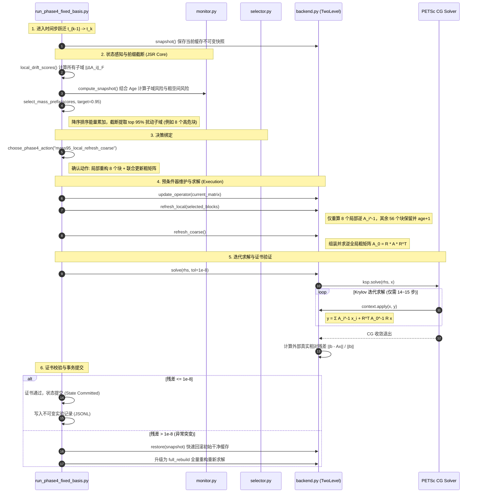

# JSR (Joint Stateful Repair) 完整代码架构与实现细节解析

> 本文档系统性梳理“演化算子下多层 Schwarz 预条件器有状态联合维护（JSR）”在生产代码库中的完整结构，自顶向下穿透至**文件目录 -> 核心类/函数 -> 关键源码逐行逻辑**。

---

## 目录
1. [一、 顶层架构与文件拓扑](#一-顶层架构与文件拓扑)
2. [二、 预条件器与缓存引擎：`corrected_phase2/backend.py`](#二-预条件器与缓存引擎corrected_phase2backendpy)
3. [三、 因果漂移与风险感知器：`corrected_phase2/monitor.py`](#三-因果漂移与风险感知器corrected_phase2monitorpy)
4. [四、 mass95 核心截断与运行调度器：`run_phase2_2_comparative.py` & `run_phase4_fixed_basis.py`](#四-mass95-核心截断与运行调度器run_phase2_2_comparativepy--run_phase4_fixed_basispy)
5. [五、 成本模型与自适应动作选择器：`corrected_phase2/selector.py`](#五-成本模型与自适应动作选择器corrected_phase2selectorpy)
6. [六、 单步生命周期微观执行流（$t \to t+1$ 序列图）](#六-单步生命周期微观执行流t-to-t1-序列图)
7. [七、 核心参数与经验先验汇总表](#七-核心参数与经验先验汇总表)

---

## 一、 顶层架构与文件拓扑

```text
/mnt/h/mypaper/.../correction_partition_v1_20260828/
│
├── corrected_phase2/                        # JSR 核心算法包
│   ├── __init__.py
│   ├── backend.py                           # 【预条件核心】两级 Schwarz 算子、Factor/CoarseState 缓存生命周期
│   ├── monitor.py                           # 【有状态感知】Frobenius 局部矩阵差分、Age 老化加权与风险评估
│   ├── selector.py                          # 【决策调度】候选动作枚举、历史在线成本评估 (OnlineHistory)
│   ├── changing_backend.py                  # 【动态谱基扩展】Phase 4-B 谱粗空间支持
│   └── changing_basis.py                    # 【动态谱基扩展】GenEO 谱特征向量粗网格投影
│
├── run_phase2_2_comparative.py              # 【生产运行调度】local_drift_scores、select_mass_prefix (mass95)
├── run_phase4_fixed_basis.py                # 【消融验证】固定粗基消融驱动 (证明联合更新 coarse 的必要性)
└── run_phase5a_sparse_backend.py            # 【稀疏边界准入】PETSc GAMG 稀疏后端生命周期准入对比
```

### 核心分工与依赖关系
```
       [ 真实演化物理场 A_t ]
                 │
                 ▼
     [ monitor.py / runner ]  ───────> 计算各局部子域漂移量 ||ΔA_i||_F 与年龄 Age_i
                 │
                 ▼
   [ select_mass_prefix (mass95) ]  ───> 降序排序能量累加，截断提取 top 95% 扰动子域
                 │
                 ▼
          [ backend.py ]      ───────> refresh_local(selected)  (只求逆选中块)
                 │                     refresh_coarse()          (联合更新粗网格 A_0)
                 ▼
        [ TwoLevelContext ]   ───────> PETSc CG 迭代求解 A_t x = b (快速收敛)
                 │
                 ▼
     [ True-Residual Certificate ] ──> ||b - Ax|| / ||b|| <= 1e-8 验收，异常则触发回滚
```

---

## 二、 预条件器与缓存引擎：`corrected_phase2/backend.py`

这是整个系统底层数值操作的枢纽，将两级 Schwarz 预条件器的每个局部逆和粗网格抽象为**不可变缓存对象（Immutable Cache Objects）**。

### 1. 核心数据结构

#### (1) `Factor`（局部子域逆缓存）
```python
@dataclass(frozen=True)
class Factor:
    indices: np.ndarray      # 局部子域拥有的自由度索引集合 (一维整型数组)
    inverse: np.ndarray      # 局部密集逆矩阵 A_i^{-1} (形状: [len(indices), len(indices)])
    build_state: int         # 构建时的时间步编号 (用于追踪缓存年龄和不可变哈希)

    def signature(self) -> str:
        return array_sha(self.inverse)
```

#### (2) `CoarseState`（全局粗网格状态缓存）
```python
@dataclass(frozen=True)
class CoarseState:
    matrix: np.ndarray       # 粗网格 Galerkin 投影矩阵 A_0 = R * A * R^T
    inverse: np.ndarray      # 粗网格逆矩阵 A_0^{-1}
    build_state: int         # 构建时间步
    assembly_seconds: float  # 粗算子组装耗时
    factorization_seconds: float # 粗算子求逆耗时
    symmetry_error: float    # 对称性误差 ||A_0 - A_0^T||_max
    minimum_eigenvalue: float # 最小特征值 (保证 SPD 正定性)
```

#### (3) `CacheSnapshot`（事务恢复快照）
```python
@dataclass(frozen=True)
class CacheSnapshot:
    factors: Tuple[Factor, ...]
    build_states: np.ndarray
    ages: np.ndarray
    coarse: CoarseState
    coarse_build_state: int
    coarse_age: int
```

---

### 2. 核心算法函数与类

#### (1) `TwoLevelContext`（两级预条件器前向应用）
该类继承并绑定为 PETSc 的 `Python-PC`，在每一次 Krylov 迭代时被调用一次：
```python
class TwoLevelContext:
    def __init__(self, factors: Sequence[Factor], aggregate: np.ndarray, coarse: CoarseState):
        self.factors = list(factors)
        self.aggregate = np.asarray(aggregate, dtype=np.int64) # 细网格到粗网格的聚合映射 R
        self.coarse = coarse

    def apply(self, pc, x, y):
        xa = np.asarray(x.getArray(readonly=True)) # 输入微观残差向量
        ya = y.getArray()                          # 输出预条件修正量 M^{-1} * x
        ya[:] = 0.0

        # ---- Level 1: 局部子域独立前向应用 (各子域独立并行反解，互不通信) ----
        for factor in self.factors:
            indices = factor.indices
            ya[indices] += factor.inverse.dot(xa[indices])

        # ---- Level 2: 全局粗网格限制与延拓 (吸收全局低频误差) ----
        # 1. 限制算子 R: 将微观残差聚合到粗网格宏观节点上 (通过 aggregate 索引求和)
        restricted = np.bincount(
            self.aggregate,
            weights=xa,
            minlength=self.coarse.inverse.shape[0]
        )
        # 2. 求解全局粗方程并在细网格上进行延拓 (R^T):
        ya[:] += self.coarse.inverse.dot(restricted)[self.aggregate]
        y.assemble()
```

#### (2) `assemble_coarse_operator(...)`（固定基粗矩阵组装）
```python
def assemble_coarse_operator(matrix: dict, aggregate: np.ndarray, dimension: int, build_state: int) -> CoarseState:
    # 1. 稀疏矩阵遍历，执行 Galerkin 投影 A_0 = R * A * R^T
    coarse = np.zeros((dimension, dimension), dtype=np.float64)
    for row in range(n):
        row_agg = int(aggregate[row])
        lo, hi = int(matrix["indptr"][row]), int(matrix["indptr"][row + 1])
        for col, value in zip(matrix["indices"][lo:hi], matrix["data"][lo:hi]):
            coarse[row_agg, int(aggregate[col])] += float(value)

    # 2. 对称化修正与求逆
    symmetric = 0.5 * (coarse + coarse.T)
    inverse = np.linalg.inv(symmetric)
    min_eig = float(np.linalg.eigvalsh(symmetric)[0])
    return CoarseState(matrix=symmetric, inverse=inverse, build_state=build_state, ...)
```

#### (3) `CorrectedStatefulTwoLevel`（预条件器有状态控制器）
* **`update_operator(self, matrix)`**：原地更新 PETSc 底层矩阵数值，保持对象指针不变。
* **`refresh_local(self, matrix, current_state, selected)`**：
  * 只对传入的 `selected` 块执行局部密集抽取与求逆：`np.linalg.inv(local)`；
  * 更新选中的 `Factor`，将选中子域的 `ages` 重置为 0，记录 `build_states` 为当前步；
  * 未选中的子域：`ages[block] += 1`。
* **`refresh_coarse(self, matrix, current_state)`**：重新组装并求逆粗矩阵，粗网格年龄重置为 0。
* **`snapshot()` & `restore(snapshot)`**：保存和恢复当前所有缓存，确保如果某步求解失败可以安全无损回滚。

---

## 三、 因果漂移与风险感知器：`corrected_phase2/monitor.py`

该模块用于对演化中的物理算子进行前向感知，完全遵守因果律（绝不读取未来时间步矩阵）。

### 1. 配置与数据类
```python
@dataclass(frozen=True)
class MonitorConfig:
    age_weight: float = 0.20          # 存活年龄惩罚系数
    coarse_mean_weight: float = 0.70  # 粗空间风险计算中局部均值权重
    coarse_max_weight: float = 0.30   # 粗空间风险计算中局部最大值权重
```

### 2. 核心函数：`compute_snapshot(...)`
```python
def compute_snapshot(current, domains, local_build_states, local_ages,
                     state_matrices, coarse_build_state, ...):
    drifts = []
    risks = []
    current_pattern = np.asarray(current["indptr"])

    # 1. 逐个子域计算局部矩阵差异 (Frobenius 范数)
    for block, (build_state, age, indices) in enumerate(zip(local_build_states, local_ages, domains)):
        reference = state_matrices[int(build_state)] # 提取该子域上次构建时的历史矩阵
        delta = current["data"] - reference["data"]

        delta_sq = 0.0
        current_sq = 0.0
        for row in indices:
            lo, hi = current["indptr"][row], current["indptr"][row + 1]
            delta_sq += float(np.dot(delta[lo:hi], delta[lo:hi]))
            current_sq += float(np.dot(current["data"][lo:hi], current["data"][lo:hi]))

        # 计算相对相对 Frobenius 漂移
        drift = math.sqrt(delta_sq) / max(math.sqrt(current_sq), 1e-12)
        drifts.append(drift)
        
        # 叠加年龄惩罚：risk = drift * (1 + 0.2 * age)
        risks.append(drift * (1.0 + config.age_weight * age))

    # 2. 计算全局粗空间风险
    coarse_reference = state_matrices[int(coarse_build_state)]
    coarse_delta = current["data"] - coarse_reference["data"]
    global_drift = np.linalg.norm(coarse_delta) / np.linalg.norm(current["data"])
    
    coarse_risk = (
        config.coarse_mean_weight * float(np.mean(risks))
        + config.coarse_max_weight * float(np.max(risks))
    )
    coarse_risk = max(coarse_risk, global_drift)

    return RiskSnapshot(local_drift=tuple(drifts), local_risk=tuple(risks), coarse_matrix_risk=coarse_risk, ...)
```

---

## 四、 mass95 核心截断与运行调度器：`run_phase2_2_comparative.py` & `run_phase4_fixed_basis.py`

这是我们研究主线的灵魂所在：**mass95 能量前缀截断算法** 与 **带回滚熔断机制的单步执行流**。

### 1. 子域物理扰动打分：`local_drift_scores(...)`
在 `run_phase2_2_comparative.py` 第 325-348 行：
```python
def local_drift_scores(current, reference_by_block, domains):
    scores = np.zeros(FACTOR_COUNT, dtype=np.float64)
    for block, (reference, rows) in enumerate(zip(reference_by_block, domains)):
        delta = current["data"] - reference["data"]
        total = 0.0
        for row in rows:
            lo, hi = current["indptr"][row], current["indptr"][row + 1]
            total += float(np.dot(delta[lo:hi], delta[lo:hi]))
        scores[block] = total
    return scores
```

---

### 2. ★ 核心算法创新：`select_mass_prefix(...)`（mass95 能量截断）
在 `run_phase2_2_comparative.py` 第 350-366 行：
```python
def select_mass_prefix(scores: Sequence[float], target: float = 0.95):
    """
    JSR 核心选择器：
    不搞粗暴的固定 50% 刷新，而是将所有子域按扰动能量降序排列，
    只挑选累积达到 95% 扰动能量的前缀子域进行求逆，剩余 5% 微弱长尾安全复用。
    """
    values = np.asarray(scores, dtype=np.float64)
    ranking = sorted(range(FACTOR_COUNT), key=lambda i: (-float(values[i]), i))
    total = float(np.sum(values))
    
    if total <= 0.0:
        selected_order = []
    else:
        selected_order = []
        running = 0.0
        for block in ranking:
            selected_order.append(block)
            running += float(values[block])
            # 一旦累积能量捕获达到 95%，立刻截断！
            if running / total >= float(target):
                break

    captured = float(sum(values[i] for i in selected_order) / max(total, 1e-300))
    return sorted(selected_order), captured, total, ranking
```

---

### 3. JSR 策略选择器：`choose_phase4_action(...)`
在 `run_phase4_fixed_basis.py` 第 135-158 行：
```python
def choose_phase4_action(policy, scores, target_info, snapshot=None):
    selected, captured, total, ranking = select_mass_prefix(scores, MASS_TARGET=0.95)
    
    if policy == "reuse_all_fixed_basis":
        return action_dict("reuse", (), False, None, "fixed-basis reuse arm"), 0.0, total, ranking
        
    elif policy == "mass95_local_stale_coarse":
        # 仅局部刷新，粗网格陈旧（消融对照组）
        return action_dict("mass95_stale_coarse", selected, False, 0.95, ...), captured, total, ranking
        
    elif policy == "mass95_local_refresh_coarse":
        # ★【Ours 最佳策略】局部 mass95 + 联合刷新粗网格
        return action_dict("mass95", selected, True, 0.95, ...), captured, total, ranking
        
    elif policy == "full_local_refresh_coarse":
        # 全量重构基线
        return action_dict("full_rebuild", range(FACTOR_COUNT), True, None, ...), 1.0, total, ranking
```

---

### 4. 运行事务驱动器：`execute_transition(...)`
在 `run_phase2_2_comparative.py` 第 662-815 行：
```python
def execute_transition(..., lifecycle, domains, ...):
    # 1. 记录快照锚点 (用于故障时回滚)
    snapshot = lifecycle.snapshot()
    action_started = time.perf_counter()

    # 2. 感知与选择
    scores = local_drift_scores(current, references, domains)
    action, captured, total_mass, ranking = choose_action(policy, scores, ...)

    # 3. 更新算子 CSR 数据
    lifecycle.update_operator(current)

    # 4. 事务尝试循环 (支持熔断降级)
    while True:
        lifecycle.restore(snapshot) # 回退到初始干净缓存
        
        # 执行预条件器维护动作 (JSR)
        if action["refresh_coarse_matrix"]:
            lifecycle.refresh_coarse(current, current_state)
        else:
            lifecycle.retain_coarse()
            
        lifecycle.refresh_local(current, current_state, action["selected_local_blocks"])

        # 调用 PETSc CG 迭代求解
        solve_result, x_val, res_val = lifecycle.solve(rhs, CERT_TOL=1e-8)

        # 检查是否满足外部真实残差证书 ||b - Ax|| / ||b|| <= 1e-8
        if solve_result["converged"]:
            break # 成功收敛，跳出尝试循环！

        # 若失败且当前不是 full_rebuild，则确定性升级熔断为全量重构
        if action["action_id"] == "full_rebuild":
            break # 全量重构仍然失败，记录错误
        action = action_dict("full_rebuild", range(FACTOR_COUNT), True, None, "fallback")

    # 5. 提交状态 (Commit) 并输出审计记录
    state_committed = bool(solve_result["converged"])
    return transition_record
```

---

## 五、 成本模型与自适应动作选择器：`corrected_phase2/selector.py`

负责评估不同动作的代价与收益，回答“究竟什么时候局部更新，什么时候联合更新，什么时候必须全量重构”。

### 1. `OnlineHistory`（在线成本追踪器）
```python
class OnlineHistory:
    observations: Dict[str, List[ActionObservation]]
    
    def estimate(self, action_id: str, config: SelectorConfig, selected_count: int = 0):
        # 如果已经有该动作的历史执行样本，直接返回中位数
        values = self.observations.get(action_id, [])
        if values:
            return (
                float(statistics.median(v.total_seconds for v in values)),
                float(statistics.median(v.solve_seconds for v in values))
            )
        # 否则使用严谨的硬件成本先验公式预估：
        if action_id == "reuse":
            return 0.0, config.solve_seconds_prior
        if action_id == "coarse_refresh":
            return config.coarse_seconds_prior, config.solve_seconds_prior
        if action_id == "full_rebuild":
            return config.coarse_seconds_prior + config.local_seconds_per_block_prior * 144.0, config.solve_seconds_prior
        return config.local_seconds_per_block_prior * max(1, selected_count), config.solve_seconds_prior
```

### 2. `enumerate_actions(...)`（枚举 6 类候选动作）
```python
ACTION_ORDER = (
    "reuse",           # 1. 彻底复用 (风险皆在软预算内)
    "local_partial",   # 2. 仅局部自适应更新 (粗空间未过时)
    "coarse_refresh",  # 3. 仅刷新粗网格 (局部块安好，全局低频漂移)
    "joint_partial",   # 4. ★ 联合局部与粗网格更新 (JSR 典型状态)
    "full_local_only", # 5. 刷新全部局部块，保留粗网格
    "full_rebuild",    # 6. 全量推倒重构 (兜底保底)
)
```

### 3. `select_action(...)`（贪心成本决策）
```python
def select_action(snapshot, factor_count, history, config):
    candidates = enumerate_actions(snapshot, factor_count, history, config)
    # 剔除违反安全硬预算 (hard_budget) 的不合格动作
    admissible = [c for c in candidates if c.safety_admissible]
    
    # 在所有安全动作中，挑选预估总耗时 (predicted_total_seconds) 最短的动作
    selected = min(admissible, key=lambda a: (a.predicted_total_seconds, ACTION_ORDER.index(a.action_id)))
    return selected, candidates
```

---

## 六、 单步生命周期微观执行流（$t \to t+1$ 序列图）

以下序列图完整反映了在任意单步 $t_{k-1} \to t_k$ 跃迁时，各个文件中的函数协同工作的完整执行流：



---

## 七、 核心参数与经验先验汇总表

在阅读和修改代码时，以下是 JSR 系统中最核心的几个冻结数值与超参数：

| 参数名 | 所在文件 | 默认取值 | 物理/算法含义 |
|---|---|---|---|
| `MASS_TARGET` | `run_phase2_2_comparative.py` | `0.95` (95%) | JSR 能量截断阈值（只重构贡献 95% 扰动的前缀子域） |
| `KSP_RTOL` | `run_phase4_fixed_basis.py` | `1.0e-10` | PETSc 内部 CG 算法停止迭代判据 |
| `CERT_TOL` | `run_phase4_fixed_basis.py` | `1.0e-8` | 独立于 PETSc 的外部物理真实残差证书阈值 |
| `MAX_IT` | `backend.py` | `2000` | 单步 Krylov 迭代最大允许步数 |
| `age_weight` | `monitor.py` | `0.20` | 存活年龄惩罚因子（每老化一步，名义风险上升 20%） |
| `coarse_mean_weight` | `monitor.py` | `0.70` | 粗空间风险中局部平均漂移的占比 |
| `coarse_max_weight` | `monitor.py` | `0.30` | 粗空间风险中局部最大漂移的占比 |
| `local_soft_budget` | `selector.py` | `0.50` | 局部子域软预算（超过该值必须被选择重构） |
| `max_local_age` | `selector.py` | `2` | 子域最大存活寿命（满 2 步强制换血，防止长期误差积累） |
| `max_coarse_age` | `selector.py` | `2` | 粗网格最大存活寿命 |

---

*本文档已同步持久化存放在工作区中，可随时在 VS Code 或终端中对照源代码比对查阅。*
